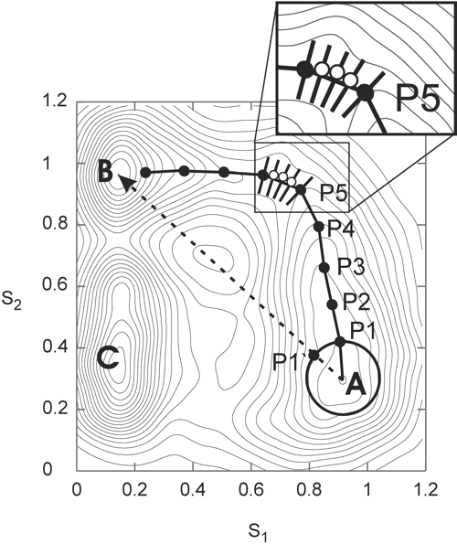

# Trace_IRC

Tool to trace the minimum free energy pathway in a multidimensional free energy landscape 
computed using metadynamics.

There is not really a manual, but the source code is fairly well 
commented and not that complex, so I recommend having a look at it.

The code expects an input file named "trace_irc.in". Running the
code with the "-h" flag, gives a list of the keywords. See also
the example. The metadynamics free energy surface is reconstructed
by summing up the Gaussian hills, which are read from input (either a HILLS file
as produced by [Plumed](https://www.plumed.org) or 
[CP2K](https://www.berlios.de/software/cp2k/) or the colvar_val 
and dcolvar_val files as produced by [CPMD](https://github.com/CPMD-code). 
Perhaps the format of these files has changed recently, or you wish to use 
metadynamics output from another program. In that case, it should not be so difficult
to adapt the code to read your data.

In addition, the code can also read in a 2D potential on a grid as
the input to find minima and/or a connecting path in (see example_2D_pes).

Below are some further remarks on using this code. I also recommend
having a look at Ref. [1] for a detailed description and a typical application.

### How does it work

The program tries to find a path in 3 steps:

 1. optimize the two local minima
 1. locate a coarse path
 1. refine the path

First check if the stable states are minimized as expected (use `TNOTRACE`
to just do this, after that put the found minima in the input file as `MINIMA` to not waste time on optimizing the minima anymore).

To find the pathway, first play with the `BRACKETSIZE` numbers to find at least a coarse path that connects the stable states (you might as
well set `NSMALLSTEPS` to 1 or so). Set the second number such that you can expect to find between 3 and 10 points in between the stable
points. E.g. suppose that your stable states are at (0,0) and (3,4) so that the shortest distance between them is 5 and you aim for at least
4 points, then you set this number to 1.0. The first `BRACKETSIZE` number is then left to play with; the default is 0.2, but I have had
to vary it from 0.01 to 2.0 to find a successful coarse pathway. It depends of course on the dimensions of the collective variables and
the smoothness of the metadynamics FES.

Once you have a set of `BRACKETSIZE` numbers  that gives you a coarse
pathway, set the `NSMALLSTEPS` to increase the number of points along
the path. The default is 10. If the metadynamics is still far from
converged and thus not so smooth, the final path might require a fair
bit of smoothing. Also the FE along the final path might need some
smoothing for the same reason, especially if you need its derivative
in an umbrella sampling run afterwards.

Mind you that the program does not take into account that you might
have very different types of collective variables. If you for example
have an angle CV going from 0 to pi and a distance CV going from 0 to
10, for best results, you either have to rescale first your
metadynamics output or adapt the trace_irc program.

### References 

[1] "A recipe for the computation of the free energy barrier and
  lowest free energy path of concerted reactions."
  Bernd Ensing, Alessandro Laio, Michele Parrinello and Michael L. Klein
  _J. Phys. Chem. B_ __109__ (2005), 6676-6687 
  [DOI: 10.1021/jp045571i](https://pubs.acs.org/doi/10.1021/jp045571i)
  

